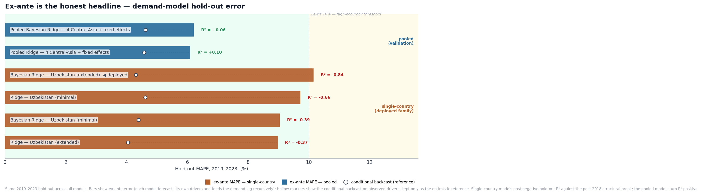
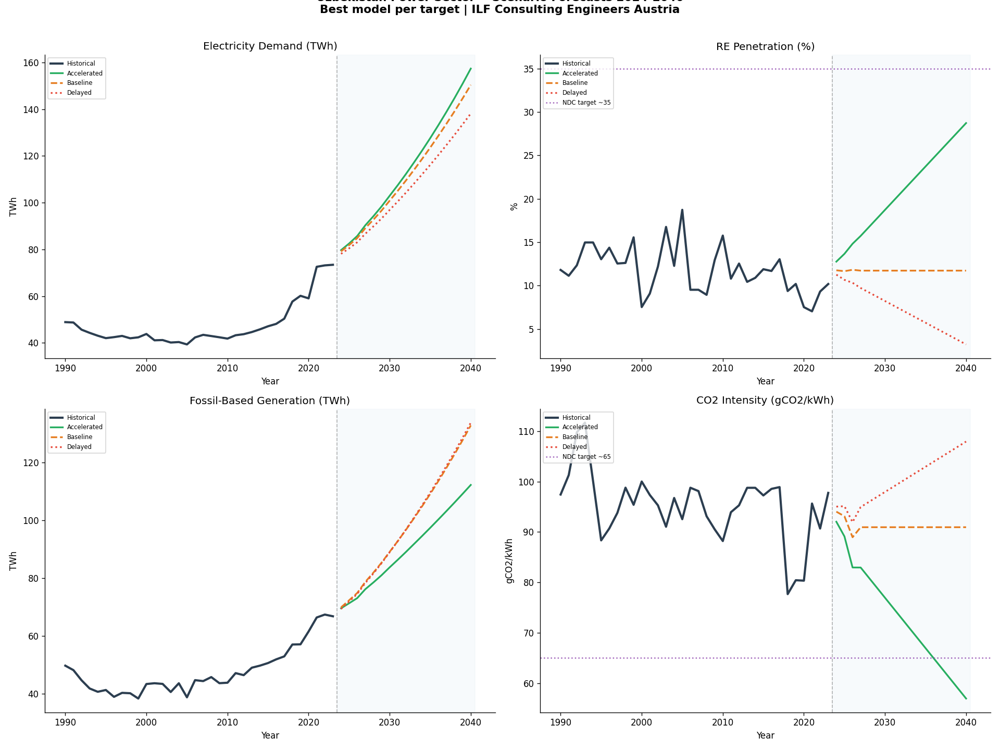
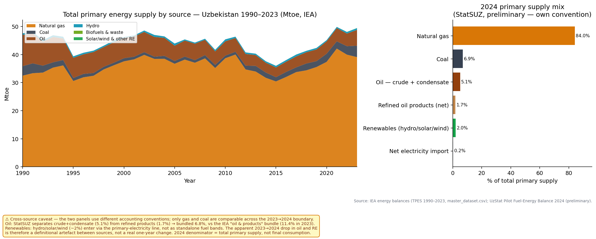
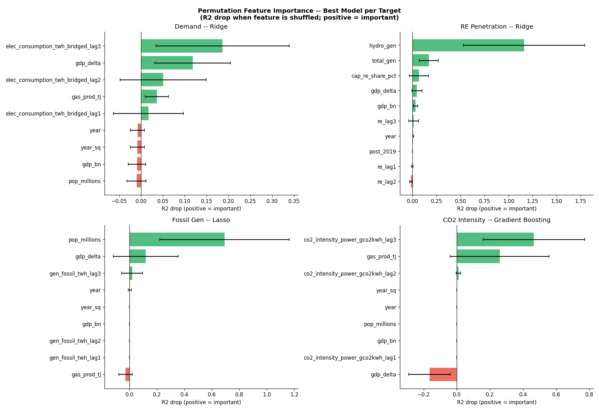
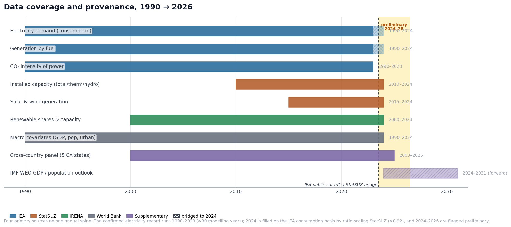

# Uzbekistan — Power Sector Transition Tracker

Forecasting Uzbekistan's power-sector transition to 2040: demand, generation mix, CO₂ paths
and supply-adequacy signals — with an interactive dashboard on top of the full analysis.

M.Sc. Business Analytics capstone · Central European University × ILF Consulting Engineers
· Farangiz Jurakhonova

**▶ Live dashboard:** https://huggingface.co/spaces/feyajk/uzbekistan-power-tracker

---

## Key results

**The headline number is the honest one.** Six specifications were benchmarked on a shared
hold-out. A conditional backcast flattered the single-country models to ~4.0% MAPE, but every
single-country specification had a **negative** out-of-sample R² — worse than predicting the
mean. Pooling four Central Asian countries with fixed effects was the only approach that
generalised, and that is the result reported to stakeholders.

| Model | Basis | n | Ex-ante MAPE | Ex-ante R² |
|---|---|---|---|---|
| **Pooled Ridge CV-alpha (4 CA + FE)** | ex-ante (UZB slice) | 72 | **6.08%** | **+0.099** |
| Pooled BayesianRidge (4 CA + FE) | ex-ante (UZB slice) | 72 | 6.20% | +0.063 |
| Ridge CV-alpha (UZB, extended + UzStat) | ex-ante | 28 | 8.97% | −0.371 |
| BayesianRidge (UZB, minimal) | ex-ante | 28 | 9.03% | −0.393 |
| Ridge CV-alpha (UZB, minimal) | ex-ante | 28 | 9.71% | −0.656 |
| BayesianRidge (UZB, extended) | ex-ante | 28 | 10.14% | −0.838 |

Reporting 6.08% over the more flattering 4.04% figure was a deliberate choice: ex-ante is the
number leadership has to plan against.



**Demand forecast with quantified uncertainty**, not a single point estimate:



**Generation mix and the drivers that actually move it** — driver attribution via permutation
importance rather than coefficient size:




**Every figure is traceable to source.** A provenance table records column-level lineage for
the master dataset — what each field means, which source it came from, and how it was derived:



---

## Method

| Stage | Approach |
|---|---|
| Data | 84-column master dataset (33-column analytical core) from IEA, IRENA, World Bank, Ember and StatSUZ |
| Provenance | Column-level lineage table; every derived field traced to its source |
| EDA | Supply drivers, demand drivers, correlation structure, energy intensity, sectoral split |
| Forecasting | Ridge and Bayesian Ridge with CV-tuned alpha; pooled 4-country panel with fixed effects |
| Validation | Shared hold-out, TimeSeriesSplit, bootstrapped confidence bands |
| Interpretation | SHAP and permutation importance for driver attribution |
| Scenarios | Baseline / accelerated / delayed generation-mix and CO₂ pathways |
| Delivery | Plotly Dash app (bilingual EN/RU), containerised and deployed |

## Repository structure

```
notebooks/     01 data pipeline → 08 investment signals (in execution order)
scripts/       reusable pipeline and scoreboard-building code
data/          raw, interim and processed datasets + provenance table
outputs/       exported figures and HTML artefacts
dashboard/     Plotly Dash application (app.py)
docs/          capstone report
paper/         LaTeX source for the written paper
Dockerfile     container image used for deployment
```

## Data sources

IEA · IRENA · World Bank · Ember · State Committee on Statistics of Uzbekistan (StatSUZ)

---

## Run locally

```bash
pip install -r dashboard/requirements.txt
cd dashboard && python app.py
# → http://127.0.0.1:8050
```

## Deploy on Hugging Face Spaces (free, persistent)

1. Create an account at <https://huggingface.co> and click **New Space**.
2. Owner = you, Space name = e.g. `uzbekistan-power-tracker`, **SDK = Docker**, visibility Public.
3. Push this repository to the Space's git remote:
   ```bash
   git remote add space https://huggingface.co/spaces/<your-username>/uzbekistan-power-tracker
   git push space main
   ```
   (Authenticate with a Hugging Face **write** access token when prompted.)
4. The Space builds from the root `Dockerfile` and serves on port 7860 (set by the
   `app_port` header above). First build takes a few minutes; the public URL is then live.

The `.dockerignore` keeps the image small: only `dashboard/` and `data/processed/*.csv`
are needed at runtime.

## Data sources

IEA, IRENA, World Bank Data360, StatSUZ (State Statistics Committee of Uzbekistan),
OWID, EDB. Forecasts from project notebooks 03–07. No figures are invented; every number
traces to a processed CSV in `data/processed/`.
